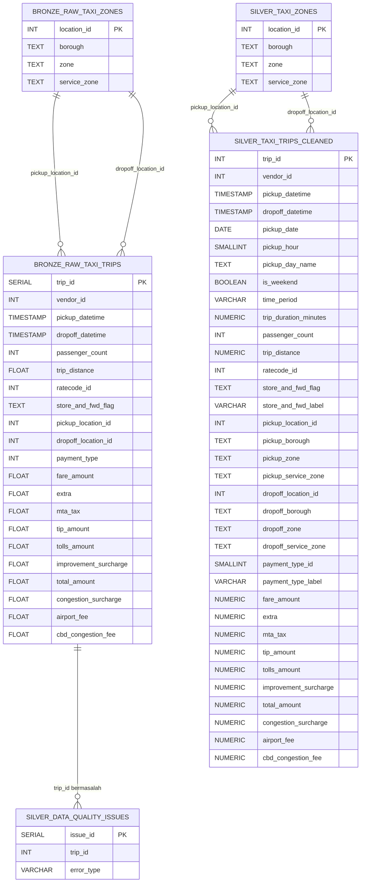

# Capstone Project 2 — Taxi Data Pipeline

## Deskripsi Project

Project ini merupakan Capstone Project Module 2 dari Bootcamp Data Engineer Purwadhika.

Project ini bertujuan membangun pipeline data otomatis untuk mengolah data NYC Taxi menggunakan Python, SQL, Shell Script, PostgreSQL, Docker, dan Docker Compose. Proses pipeline mencakup pengambilan data, load data ke Bronze, transformasi ke Silver, pembuatan view Gold Mart, pengecekan kualitas data, serta penyimpanan log proses pipeline.


## Cara Menjalankan Keseluruhan Project

1. Buka Visual Studio Code, lalu buka terminal di Visual Studio Code nya

2. Clone Repository
    
    ```bash
    git clone https://github.com/jonathansionk/capstone2_taxi_data_pipeline
    cd capstone2_taxi_data_pipeline

3. Pastikan Docker Aktif
    Buka Docker Desktop
    Pastikan status Running

4. Jalankan Pipeline

    Pastikan terminal berada di folder project yang terdapat file docker-compose.yml.
    Kemudian jalankan:
    ```bash
    docker compose up --build

5. Pipeline Berjalan Otomatis

    Pipeline akan berjalan dengan urutan:

    Database Initialization → Extract Raw Data → Load Bronze → Transform Silver → Mart Gold

6. Database dapat di cek dengan menggunakan DBeaver

    konfigurasi koneksi ke Postgre SQL sebagai berikut :
        Host      = `localhost` 
        Port      = `5339`      
        Database  = `taxi_db`  
        Username  = `taxi_user`
        Password  = `taxi_pass`


## Cara Menjalankan Query Analisis

Query analisis disimpan pada:

```text
db/queries/06_business_questions.sql
```

Langkah menjalankan query:

1. Buka DBeaver.
2. Hubungkan ke database `taxi_db`.
3. Buka SQL Editor.
4. Buka file `06_business_questions.sql`.
5. Pilih query yang ingin dijalankan.
6. Tekan `Ctrl+Enter`.


## Struktur Folder

```text
02.Capstone Project 2/
├── data/
│   └── raw/
│       ├── yellow_tripdata_2026-01_raw.parquet
│       └── taxi_zone_lookup_raw.csv
│
├── db/
│   ├── init/
│   │   ├── 01_schema.sql
│   │   ├── 02_bronze_load.sql
│   │   └── 05_audit.sql
│   │
│   ├── transform/
│   │   ├── 03_silver_transform.sql
│   │   └── 04_gold_mart.sql
│   │
│   └── queries/
│       └── 06_business_questions.sql
│
├── logs/
│   └── pipeline.log
│
├── scripts/
│   ├── __init__.py
│   ├── extract.py
│   ├── init_database.py
│   ├── load_bronze.py
│   ├── transform_silver.py
│   ├── mart_gold.py
│   └── main.py
│
├── Dockerfile
├── docker-compose.yml
├── requirements.txt
├── run_pipeline.sh
└── README.md
```

## ERD Bronze dan Silver Layer



## Penjelasan desain tabel

#### `1. bronze.raw_taxi_trips`

Menyimpan seluruh data mentah Taxi Trip dari hasil extract.

#### `2. bronze.raw_taxi_zones`

Menyimpan seluruh data mentah Taxi Zones dari hasil extract.

#### `3. silver.taxi_trips_cleaned`

Menyimpan data perjalanan yang sudah divalidasi dan diperkaya dengan informasi tambahan.

#### `4. silver.taxi_zones`

Menyimpan referensi zona yang digunakan dalam tabel silver.taxi_trips_cleaned.

#### `5. silver.data_quality_issues`

Menyimpan perjalanan yang memiliki masalah kualitas data, antara lain:

```text
duration invalid
distance invalid
```

#### `6. Gold View`

Gold Layer berfungsi menyediakan data yang sudah siap digunakan untuk analisis dan menjawab business questions. 
Pada project ini, Gold Layer terdiri dari tiga view utama yaitu :

1. gold.vw_trip_enriched : menyajikan data perjalanan taksi yang sudah diperkaya dengan informasi tambahan.
2. gold.vw_daily_trip_summary : menyajikan ringkasan perjalanan berdasarkan tanggal pickup.
3. gold.vw_zone_performance : menyajikan performa setiap pickup zone.

---

## Daftar Business Questions

Business questions yang dianalisis:

1. Berapa jumlah total trip valid pada Januari 2026 ?
2. Berapa total revenue, avg revenue, avg fare, avg tip ?
3. Payment Type apa yang paling sering digunakan ?
4. Zone pickup yang menghasilkan total revenue tertinggi?
5. zone pickup mana yang memiliki jumlah trip tertinggi?
6. Hitung jumlah trip, revenue, dan average duration untuk setiap time period.
7. Cari tanggal dengan trip count sangat rendah/tinggi dibanding rata-rata.
8. Trip dengan durasi di atas rata-rata durasi untuk zone yang sama
9. Ranking pickup zone berdasarkan total revenue.
10. Ranking pickup zone per borough.
11. Perbandingan revenue hari ini dengan hari sebelumnya menggunakan.
12. Ambil top 3 pickup zone untuk setiap borough menggunakan ROW_NUMBER, RANK, atau DENSE_RANK.
---

## Kendala Teknis

#### Proses load data membutuhkan waktu lama

Data taxi trip berjumlah jutaan baris. Penggunaan `DataFrame.to_sql()` dengan banyak batch `INSERT` membutuhkan waktu yang cukup lama.

Solusi:

* Menggunakan PostgreSQL `COPY`.
* Menggunakan `chunksize` yang lebih besar.


